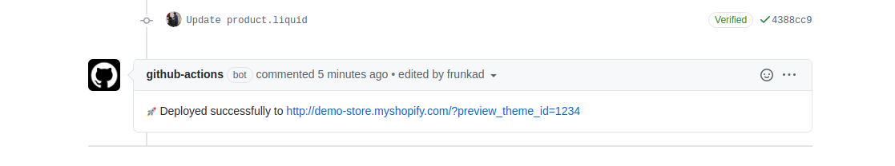

# Shopify Theme Deploy Previews Action

Deploy Previews for Pull Requests in theme repositories. 🚧 



## Getting Started

The Action creates a new theme for every opened pull request and updates the same theme when the pull request in updated.

Because, it can lead to a large number of theme, it is recommended to use [development stores](https://help.shopify.com/en/partners/dashboard/managing-stores/development-stores).

Save this file to `.github/workflows` as `deploy_preview.yaml`:

```yaml
name: 'Deploy Preview'
on: [pull_request]

jobs:
  deploy:
    runs-on: ubuntu-latest
    name: 'Deployment'
    steps:
      - name: Checkout Repository
        uses: actions/checkout@v2
      - name: 'Deploy Theme'
        uses: wyugen/shopify-theme-action@v0.3
        with:
          SHOPIFY_STORE: ${{secrets.DP_SHOPIFY_STORE}}
          SHOPIFY_APP_PW: ${{secrets.DP_SHOPIFY_APP_PW}}
          SHOPIFY_API_KEY: ${{secrets.DP_SHOPIFY_API_KEY}}
          github-token: ${{secrets.GITHUB_TOKEN}}
```

## Required Input Parameters

- SHOPIFY_STORE: The shopify store URL where theme would be deployed, in format of `demo-store.myshopify.com`  
- SHOPIFY_APP_PW: The private app's password  
- SHOPIFY_API_KEY: The private app's API Key  
- github-token: GitHub token used to post comments (autofilled)  

Because the theme ids are dynamically generated, the action does not honour config.yaml. To get these variables, refer [themekit documentation](https://shopify.github.io/themekit/)

## Using with your build tools (or Slate)

To use it with slate or another build tool, adding the build command after checkout would automatically ship the build version.